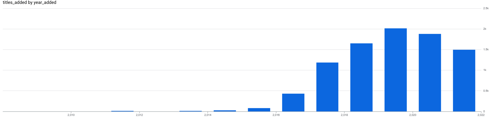

# Netflix Content Analysis using BigQuery

## 📌 Project Overview
This project analyzes Netflix content data using SQL and Google BigQuery to understand trends in content additions over time.

The goal of this project is to demonstrate:
- SQL querying skills
- Use of CTEs and window functions
- Data analysis thinking
- Ability to present insights clearly

---

## 📥 Dataset
The dataset used for this analysis is publicly available on Kaggle:

🔗 https://www.kaggle.com/datasets/shivamb/netflix-shows

---

## 🛠 Tools Used
- Kaggle – Source of the dataset
- Google BigQuery – Data storage, querying, and analysis
- BigQuery Visualization – Used to explore trends and patterns

---

## 📊 Analysis Performed
- Extracted year-wise Netflix content additions
- Analyzed growth trends over time
- Used window functions to compare yearly performance
- Identified years with highest content expansion

---

## 📈 Key Insight
Netflix shows a strong increase in content additions after 2016, indicating rapid global expansion and increased investment in original content.

---

## 📂 Project Structure

netflix-bigquery-analysis
│
├── README.md
├── queries.sql
└── screenshots
    └── content_growth.png

---

## 🧠 SQL Concepts Used
- Common Table Expressions (CTEs)
- Window Functions
- Aggregations
- Date parsing and transformation

---

## 📷 Visualization
The chart below shows the trend of Netflix content additions over time.

---

## ✅ Conclusion
This project demonstrates how SQL can be used to analyze real-world datasets and extract meaningful business insights using structured queries and analytical techniques.

